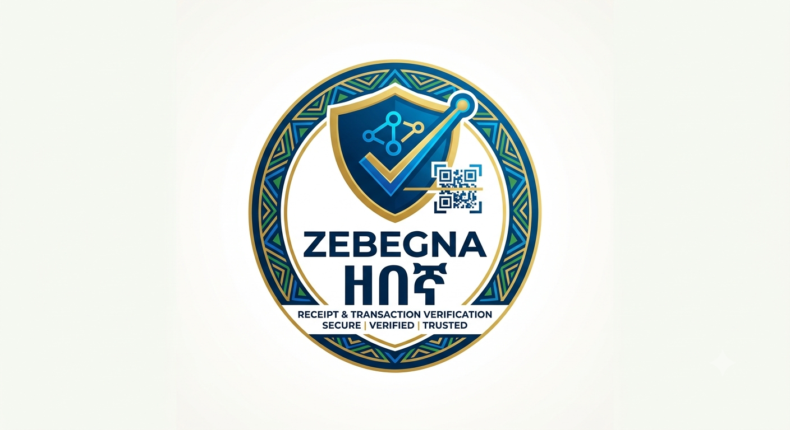

<div align="center">
  
</div>

# 🛡️ Zebebgna

**"guard"** · Defensive verification of Ethiopian bank receipts.

[](https://www.python.org/)
[]()
[]()
[](https://github.com/natahanjr/zebebgna/actions/workflows/python-package.yml)

## 📌 About

A receipt is only as trustworthy as its source. **zebebgna** (Amharic for *guard*)
is a cybersecurity toolkit that keeps fake and tampered receipts out of your
hands. It extracts receipt data from six major Ethiopian banks and mobile money
services — **CBE, Dashen, Awash, BOA, Zemen, and Telebirr** — then puts that
data on trial: it checks the serving website's security posture, flags phishing
lookalikes, reconciles the amounts, and validates every reference number. The
result is a clear, color-coded verdict: **Good, Needs review, or Problem found**.

Two interfaces, one engine:

- 🖥️ **CLI** — for developers and security teams
- 🌐 **Web UI** — a simple browser form for non-technical users

Zebebgna is the defensive counterpart to naive receipt-scraping libraries —
it never trusts the receipt it fetches.

---

## ⚠️ Scope & Ethics

This tool is built for **defensive security only**:

- Verify receipts you are entitled to see (your own transactions, authorized reconciliation).
- Detect phishing lookalike domains and tampered receipts before they are trusted.
- Report transport weaknesses (expired/invalid TLS certs, missing security headers, insecure URLs) to the operators who control them.

It is **not** a tool for bypassing access controls, enumerating accounts, or attacking bank infrastructure. Unauthorized probing of third-party systems is illegal in most jurisdictions — audit only endpoints you own or are authorized to test.

---

## ✅ Features

- 🔐 **Strict TLS everywhere** — every fetch verifies the certificate chain; plain-HTTP URLs are refused (`verify_ssl=False` shortcuts, like those found in naive scrapers, are never used).
- 🎣 **Phishing detection** — flags raw-IP hosts, lookalike domains (typosquatting against known bank domains), punycode hosts, URL shorteners, and non-standard ports.
- 📜 **TLS certificate audit** — chain validation, hostname coverage (SAN), expiry, and issuer.
- 🧱 **Security headers audit** — HSTS (incl. `includeSubDomains`), CSP, X-Frame-Options, X-Content-Type-Options, Referrer-Policy, Permissions-Policy.
- 🔍 **Authenticity verification** — cross-field amount reconciliation (e.g. transferred + commission + VAT ≈ total debited), per-bank reference-number format checks, and transaction-status validation.
- 📊 **Risk scoring** — every check yields a severity-tagged finding; the report summarizes a 0–100 score and PASS / REVIEW / FAIL verdict.

---

## 📦 Installation

```bash
pip install -e .
```

## 📖 Usage (Python)

### Full verification (extract + authenticity + transport audit)

```python
from zebebgna import verify_receipt
from pprint import pprint

report = verify_receipt("cbe", "https://apps.cbe.com.et:100/?id=FT25211G11JQ21827223")
pprint(report.to_dict())

print(report.score)   # 0-100
print(report.status)  # PASS | REVIEW | FAIL
for f in report.findings:
    print(f.severity.upper(), f"- [{f.category}] {f.message}")
```

Telebirr accepts a bare receipt ID:

```python
report = verify_receipt("tele", "CHQ0FJ403O")
```

### Transport-only audit (no extraction)

```python
from zebebgna import audit_receipt_url

report = audit_receipt_url("https://example-receipt-host/abc123")
```

## 🧰 CLI Usage

```bash
# Full verification pipeline
zebebgna verify cbe "https://apps.cbe.com.et:100/?id=FT25211G11JQ21827223"
zebebgna verify tele CHQ0FJ403O

# Transport/URL security audit only
zebebgna audit "https://receipt.dashensuperapp.com/receipt/387ETAP2522000WK"
```

## 🌐 Web UI (for non-technical users)

A simple browser interface lets anyone verify receipts without touching a terminal:

```bash
pip install -e ".[web]"
python webapp.py
# open http://127.0.0.1:5000
```

Pick the bank, paste the receipt link (or Telebirr ID), and get a color-coded verdict: **Good**, **Needs review**, or **Problem found** — plus the list of checks and the extracted receipt details.

**Hardening for shared use:** the app only fetches HTTPS URLs and, when set, respects an allowlist of hosts the server may fetch (SSRF guard):

```bash
zebebgna_ALLOWED_HOSTS="apps.cbe.com.et,transactioninfo.ethiotelecom.et" python webapp.py
```

If you expose the UI beyond your own machine, put it behind authentication (e.g. reverse proxy) and only allow hosts you trust.

## 📄 Sample Report

```json
{
  "url": "https://receipt.dashensuperapp.com/receipt/387ETAP2522000WK",
  "bank": "dashen",
  "score": 74,
  "status": "REVIEW",
  "extracted_data": { "...": "..." },
  "findings": [
    {"severity": "info", "category": "tls", "message": "Certificate valid until Nov 12 2027 ..."},
    {"severity": "warn", "category": "headers", "message": "Missing security header: Content-Security-Policy"},
    {"severity": "error", "category": "integrity", "message": "Dashen total mismatch: ..."}
  ]
}
```

## 🧪 Testing

```bash
pip install pytest
pytest tests/
```

## 📜 License

MIT License.
